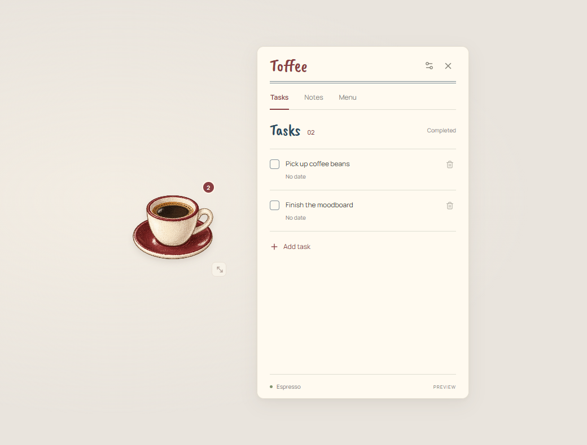
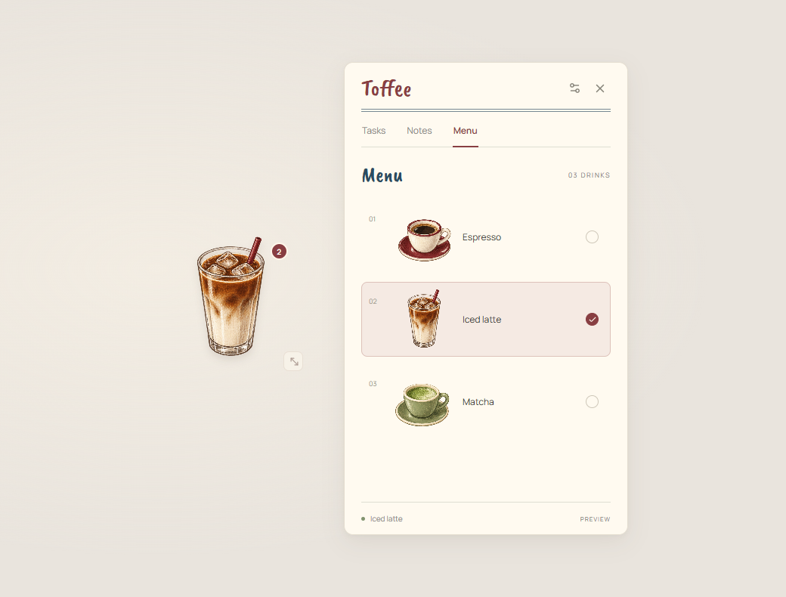

# Toffee

A small Windows desktop companion for tasks, notes, and reminders, tucked behind your favorite drink. Choose espresso, iced latte, or matcha, then keep your cup wherever it fits on your desktop.

Built with Electron, React, TypeScript, and Vite. Your data stays on your device, with no account or cloud service required.

## Preview

| Tasks | Drink menu |
| :---: | :---: |
|  |  |

## Features

- Create, edit, complete, reopen, and delete tasks.
- Add optional deadlines and reminders at the deadline or 10, 30, or 60 minutes before it.
- Keep notes that autosave after 400 ms and when leaving the field or switching panels.
- Receive small reminder popups with completion, 10-minute snooze, and dismiss controls.
- Move and resize the floating drink widget with a mouse or keyboard.
- Remember your drink, widget position, size, and settings between sessions.
- Enable keep-on-top and, in packaged builds, launch at Windows sign-in.
- Export a JSON backup from Settings.

## Getting started

### Requirements

- Windows x64 for the current desktop build and packaging configuration.
- Node.js 22.12 or newer and npm. Development has been verified with Node.js 22.22.
- Git to clone the repository.

From the project directory, install the locked dependencies and launch the app:

```sh
npm ci
npm start
```

`npm start` checks TypeScript, builds the interface, and launches Electron. Installation and initial packaging need an internet connection to download dependencies. The app itself uses bundled fonts and artwork and makes no runtime network requests.

### Browser preview

```sh
npm run dev
```

Open the local URL printed by Vite. The preview lets you work on the interface with hot reload. It stores its own data in browser localStorage and does not provide the native desktop widget, tray, or Windows startup integration.

## Using the widget

| Action | Control |
| --- | --- |
| Open or close the task panel | Click the drink |
| Move the widget | Drag the drink |
| Resize the widget | Drag the bottom-right handle, from 110 to 380 px |
| Move with the keyboard | Focus the drink and press an arrow key |
| Resize with the keyboard | Focus the resize handle and press an arrow key |
| Make larger keyboard adjustments | Hold Shift while pressing an arrow key |
| Change drinks | Open Menu in the panel |
| Quit the app | Use the system tray menu |

Closing the panel leaves the app running in the tray so reminders can continue.

### Reminder behavior

The desktop process checks for due reminders every ten seconds and after waking from sleep. Missed reminders are picked up when the app starts again. Completion, snooze, and dismissal are saved across restarts.

Each reminder appears in a separate 340 by 180 px popup without opening or focusing the task panel. Popups are dismissed automatically after 30 seconds, then the next queued reminder appears. These are app-owned popups, not Windows Notification Center entries.

The app must be running to display reminders. It cannot notify while Windows is off or after you quit the app. Tasks without a deadline do not trigger reminders.

## Development commands

| Command | Purpose |
| --- | --- |
| `npm run dev` | Start the browser preview with hot reload |
| `npm run build` | Check TypeScript and build the interface into `dist/` |
| `npm start` | Build and launch the desktop app |
| `npm test` | Run domain, reminder, validation, and storage tests |
| `npm run test:ui` | Run Playwright browser and Electron integration tests |
| `npm run package` | Build a portable Windows executable |

### Tests

```sh
npm test
npm run build
npm run test:ui
```

Build before running the UI suite. The browser test uses an installed Microsoft Edge, and Playwright starts a preview server on port 4173, which must be available. Electron tests cover task editing, notes, drink selection, reminders, restart persistence, widget movement, and resizing. They use isolated data directories under `test-results/`.

### Portable Windows build

```sh
npm run package
```

The current version produces `release-v0.2/Toffee-0.2.0.exe`. Generated executables, dependencies, build output, and local app data are excluded from Git.

To create a desktop shortcut after packaging, run this from PowerShell:

```powershell
.\scripts\create-desktop-shortcut.ps1
```

Keep the project folder in place because the shortcut references the executable and icon inside it. Quit an older running version through its tray menu before launching an update. Packaged versions use the same user-data location so existing tasks and notes are retained.

The executable is an unsigned development build. Code signing and broader testing across multiple monitors and DPI settings remain release work.

## Data and backups

| Mode | Storage location |
| --- | --- |
| Desktop development | `.daily-brew-dev/daily-brew.json` in the project |
| Packaged desktop app | `%APPDATA%/Daily Brew/daily-brew.json` |
| Browser preview | Browser localStorage under `daily-brew-preview-v1` |

Desktop writes use a temporary file followed by a rename. The previous snapshot is preserved as `daily-brew.json.backup`. If saved data cannot be read or validated, the desktop app stops without overwriting it.

To restore an exported desktop backup:

1. Quit Toffee through the tray menu.
2. Make a copy of your existing data file and its backup.
3. Copy the exported JSON into the appropriate desktop data directory and name it `daily-brew.json`.
4. Launch Toffee again.

For development and automated tests, `BREW_DATA_DIR` overrides the desktop data directory. Browser preview data is separate from desktop data.

Toffee keeps the original Daily Brew storage paths and browser storage key so the rename preserves existing tasks and notes.

## Project structure

```text
electron/
  main.mjs          Native windows, tray, reminders, and IPC
  preload.cjs       Allowlisted renderer bridge
  domain.mjs        State validation and task/reminder rules
  storage.mjs       Local JSON persistence and backups
src/
  main.tsx          Widget, panels, and reminder interface
  bridge.ts         Desktop bridge and browser preview storage
  types.ts          Shared TypeScript interfaces
  styles.css        Panel styles and typography
  widget.css        Floating drink styles
public/
  assets/           Drink artwork and app icons
  licenses/         Bundled font licenses
scripts/            Packaging, icon, shortcut, and smoke-test helpers
tests/              Node.js unit tests and Playwright integration tests
docs/               Screenshots and artwork generation prompts
```

Renderer processes are sandboxed with Node integration disabled and context isolation enabled. They access native functionality through an allowlisted preload API. The main process validates IPC senders and state updates, and blocks navigation and new windows.

## Artwork and fonts

- Drink artwork: [sprite sheet](public/assets/drinks.png), generated with Imagegen. See the [drink artwork prompt](docs/drink-art-prompt.md).
- App icon: [icon artwork](public/assets/app-icon.png). See the [icon prompt](docs/app-icon-prompt.md).
- Headings: Caveat Brush, with its [bundled license](public/licenses/caveat-brush.txt).
- Interface: Manrope, with its [bundled license](public/licenses/manrope.txt).

## License

No project-wide license has been specified. Bundled font licenses are provided in `public/licenses/`.
